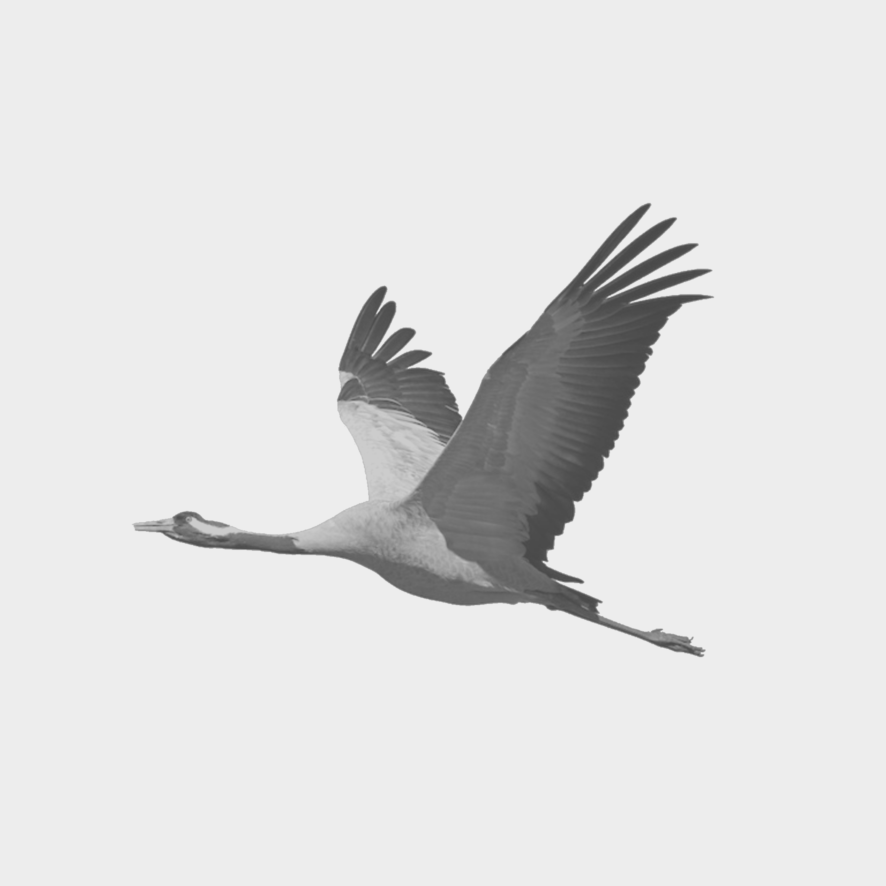

<div align="center">

# CrAnE

**三档灰，两片翼，一折线。**

<a href="https://xhugoliu.github.io/CrAnE/"></a>

[SVG](assets/CrAnE.svg) · [1024 × 1024 PNG](assets/CrAnE.png) · [交互动画 ↗](https://xhugoliu.github.io/CrAnE/) · [HTML 源文件](index.html)

</div>

## 看它成形

[交互动画](https://xhugoliu.github.io/CrAnE/) 是一段约 **14 秒**的构造动画：背景与网格渐入，关键坐标浮现，两片翼面依次描边、填充，再绘出单侧色带。坐标与网格随后退场，定稿短暂停留后默认循环播放；取消“循环”可在定稿处停下。

README 顶部内嵌同一段构造动画的 [GIF 预览](assets/CrAnE-construction.gif)，直接循环播放，画面只保留灰鹤与辅助标记。GIF 首帧使用定稿，因此加载或显示静态缩略图时也能看到完整头像。

点击 README 顶图或“交互动画”链接即可打开在线 HTML 版，支持暂停、重播、循环、拖动进度及按步骤查看。系统启用“减少动态效果”时，默认展示静态定稿，可手动播放。[HTML 源文件](index.html) 也保留在仓库中，下载后直接用浏览器打开即可离线播放，无需安装依赖。

也可以启动本地预览：

```sh
npm run preview
# 打开 http://127.0.0.1:4173
```

## 名字里有什么

**CrAnE** 读作 *crane*，意为鹤。大写的 **C、A、E** 同时指向图像的三档灰阶：

| 字母 | 色值 | 位置 |
| :---: | :---: | --- |
| **C** | `#CCCCCC` | 远侧翼面 |
| **A** | `#AAAAAA` | 近侧翼面与折线 |
| **E** | `#EEEEEE` | 背景与留白 |

这个拼写把形象和配色放进了同一个名字，也延续了 [acex](https://github.com/xhugoliu/acex) 以灰阶字母命名图案的习惯。

## 从灰鹤到 CrAnE

<table>
  <tr>
    <td align="center"><br><strong>GrusGrus</strong><br>姿态与留白</td>
    <td align="center"><br><strong>acex</strong><br>灰阶与秩序</td>
    <td align="center"><br><strong>CrAnE</strong><br>形态与规则</td>
  </tr>
</table>

它起于一张用了多年的头像：去色处理的灰鹤（*GrusGrus*），在大面积留白中展翅飞行，带有一点水墨气息。后来，头像换成了只有三档灰阶、由五个方块构成的几何 X。

CrAnE 保留灰鹤的飞行姿态，也继承几何 X 的克制。羽毛、眼睛和喙的细节逐渐退去，留下两片翼面与一条向前伸展、向后下折的线。三角形顶点和折线控制点都落在整数网格上，构造可以用一小段话说清楚。

## 几何定义

坐标系为 **16 × 16**。左上角是 `(0,0)`，X 向右、Y 向下。按下表从上到下绘制：

| 图层 | 颜色 | 构造 |
| --- | --- | --- |
| 背景 | E | 覆盖整个画布的正方形 |
| 远侧翼面 | C | 三角形 `(6,10) → (5,4) → (10,10)` |
| 近侧翼面 | A | 三角形 `(6,10) → (12,3) → (10,11)` |
| 折线色带 | A | 上边界为 `(2,10) → (6,10) → (14,12)`，向下侧展开宽度 `0.5` |

三角形闭合填充。折线定义色带的**可见上边界**，宽度沿各线段的垂直方向量取，仅向下侧展开；端点平切，转角采用尖角连接。色带下边界由宽度规则计算，无需额外记忆坐标。

- 两片翼面与色带上边界在 **`(6,10)`** 共点，可见轮廓也在此汇合。
- 上边界先向右走 **4 格**，再向右 **8 格**、向下 **2 格**。
- 近侧翼面的下顶点 **`(10,11)`** 是斜线段的中点，其下沿与色带上边界重合。
- 近侧翼面覆盖远侧翼面的一部分；色带最后绘制。
- PNG 中每格对应 **64 像素**，色带垂直于线段的宽度对应 **32 像素**。

### 复原口令

> 十六格的 E 色方纸，以 `(6,10)` 为支点。C 翼连接 `(5,4)` 和 `(10,10)`；A 翼连接 `(12,3)` 和 `(10,11)`。从 `(2,10)` 水平连到支点，再连到 `(14,12)`；以这条折线为上边界，向下侧铺开半格宽的 A 色带。

SVG 用整数坐标的裁剪区域保留描边的下半侧，同时容纳近侧翼面，让同色部分在内部重叠，避免抗锯齿显示时出现细缝。代码中的描边宽度为 `1`，露在翼面外的实际色带宽度为 **`0.5`**：

```svg
<svg xmlns="http://www.w3.org/2000/svg" viewBox="0 0 16 16">
  <defs>
    <clipPath id="silhouette"><path d="M0 10L6 10L14 12L16 12L16 16L0 16ZM6 10L12 3L10 11Z"/></clipPath>
  </defs>
  <rect width="16" height="16" fill="#eee"/>
  <polygon fill="#ccc" points="6,10 5,4 10,10"/>
  <g clip-path="url(#silhouette)">
    <polygon fill="#aaa" points="6,10 12,3 10,11"/>
    <polyline fill="none" stroke="#aaa" stroke-width="1" points="2,10 6,10 14,12"/>
  </g>
</svg>
```

## 复现与校验

需要 **Node.js 22 或更新版本**，无第三方依赖，无需安装包。

```sh
npm run check  # 只读校验定稿资产
npm run build  # 从几何定义重新生成两个资产
```

`scripts/crane.mjs` 集中保存尺寸、配色、控制点和色带宽度。SVG 用裁剪表达单侧色带；PNG 从同一组控制点计算等价的色带轮廓，并按像素中心采样。三角形与色带都是实色填充，不做抗锯齿。PNG 使用三色索引调色板，实际像素严格只有 `#AAA`、`#CCC`、`#EEE`，没有透明通道。

校验会检查 SVG 构造，以及 PNG 的尺寸、调色板、数据完整性和全部像素；压缩字节的差异不会被误认为图像发生变化。SVG 在浏览器中通常会经过抗锯齿显示，因此需要严格三色像素时使用 PNG。

每次推送或提交 Pull Request 时，GitHub Actions 会校验资产并重新构建，检查生成结果是否与仓库中的定稿一致。

## 文件

```text
index.html            可独立打开的构造动画
assets/
  CrAnE.svg          矢量定稿
  CrAnE.png          1024 × 1024 三色位图定稿
  CrAnE-construction.gif  README 内嵌构造动画，640 × 640
  background/
    GrusGrus.png     最初的去色灰鹤头像
    xhugoliu.png     acex 几何 X 头像
scripts/
  crane.mjs          几何定义、生成与校验
  preview.mjs        本地动画预览服务
```

`CrAnE.svg` 与 `CrAnE.png` 是当前定稿，`CrAnE-construction.gif` 用于动画展示；`background/` 保存设计背景参考。
